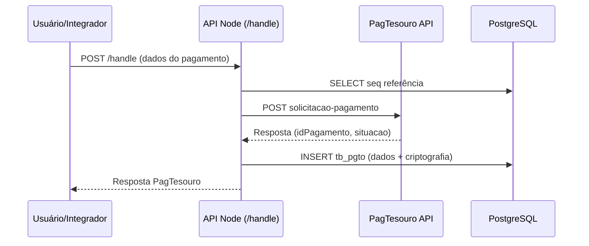
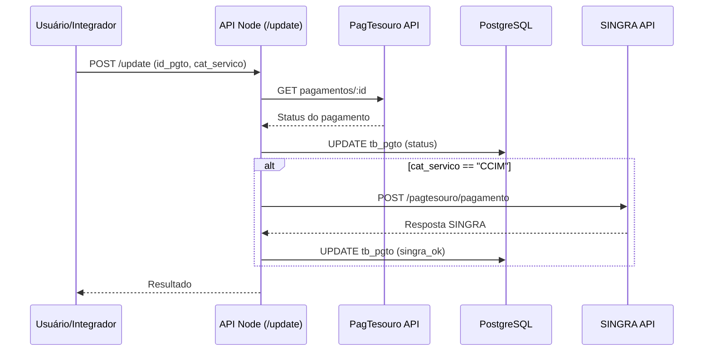

# Diagnóstico rápido do repositório

## Inventário (alto nível)
- Backend Node.js com Express em `server.js` e `pgt.js` (integração com PagTesouro e gravação em Postgres).
- Front-end/backoffice em PHP em `INDEX/` (formulário de emissão e login) e `grid/` (consulta/atualização de pagamentos).
- Script auxiliar para testar a PAPEM em `papem_test.js` e payload de exemplo em `papem_payload.example.json`.
- Dump binário do banco PostgreSQL em `DGOM_PAGTESOURO.sql` e documento descritivo em `banco-dgom.md`.

## O que está explícito no código
- Há dois endpoints HTTP no Node: `POST /handle` e `POST /update` (`server.js`, `pgt.js`).
- O backend Node chama a API PagTesouro (`/api/gru/solicitacao-pagamento` e `/api/gru/pagamentos/:id`) e grava/atualiza registros em Postgres (`pagtesouro.tb_pgto`).
- O frontend PHP usa autenticação via tabela `pagtesouro.tb_login` e usa sessão para acesso ao grid (`INDEX/check_login.php`, `grid/index.php`).
- O grid busca dados de `pagtesouro.tb_pgto` e permite atualização de `ds_obs` (`grid/data2.php`).
- Existe criptografia de campos sensíveis (nome/CPF) no Node (crypto AES) e no PHP (openssl AES), tanto para gravar quanto para ler (`pgt.js`, `server.js`, `grid/data2.php`).
- Existe script CLI para testar o endpoint PagTesouro com token via variável de ambiente (`papem_test.js`).

## Escopo do que foi documentado aqui
Esta documentação cobre o que está presente no repositório entregue: backend Node (`server.js`, `pgt.js`), frontend/grade em PHP (`INDEX/` e `grid/`), o script de teste (`papem_test.js`) e o SQL disponível. Não foram incluídos detalhes fora desse escopo.

## Plano curto para produzir a documentação
1. Mapear os principais componentes (Node, PHP, banco, integrações externas) a partir dos arquivos-fonte.
2. Extrair rotas, fluxos e dependências evidentes no código.
3. Documentar configuração/variáveis reais encontradas e marcar lacunas como pendentes.
4. Descrever os módulos principais e fluxos de uso com exemplos baseados nos arquivos.
5. Consolidar segurança, manutenção e apêndices (repo map e pendências).

# 1. Visão Geral
- **Propósito e objetivos do sistema:** integração com o PagTesouro para criação de GRU/solicitações de pagamento, registro em banco e atualização de status, com interface web para emissão e acompanhamento (`server.js`, `pgt.js`, `INDEX/index.php`, `grid/index.php`).
- **Público-alvo:**
  - **Operadores/usuários internos** para emissão e acompanhamento via interface web (inferência baseada nos formulários e telas de login em PHP).
  - **Integrações internas** que consomem a API Node para criação e atualização de pagamentos (`POST /handle` e `POST /update`).
- **Principais funcionalidades (baseadas no código):**
  - Criar solicitação de pagamento no PagTesouro, registrar no banco e responder com dados da API (`server.js`, `pgt.js`).
  - Atualizar status de pagamentos consultando o PagTesouro e persistir no banco; integração com SINGRA para casos específicos (`server.js`, `pgt.js`).
  - Emissão de solicitações via formulário web e acompanhamento via grid (`INDEX/index.php`, `grid/index.php`).
  - Testar emissão PAPEM via CLI (`papem_test.js`).

# 2. Arquitetura

## Visão de alto nível
- **API Node (Express):** recebe solicitações de pagamento e atualização, integra com PagTesouro, persiste em Postgres e, em alguns casos, notifica o SINGRA (`server.js`, `pgt.js`).
- **Frontend PHP (INDEX/ e grid/):** telas de emissão, autenticação e acompanhamento de pagamentos (`INDEX/*.php`, `grid/*.php`).
- **Banco de dados PostgreSQL:** tabela principal `pagtesouro.tb_pgto` para armazenar pagamentos (`DGOM_PAGTESOURO.sql`), além de `tb_login` e `tb_servico` mencionadas em código (`INDEX/check_login.php`, `INDEX/index.php`, `banco-dgom.md`).
- **Serviços externos:** API PagTesouro e SINGRA (endereços explicitados no código).

### Esquema SQL disponível (extraído do dump)
O SQL abaixo é o que foi extraído do arquivo `DGOM_PAGTESOURO.sql` no repositório:

```sql
-- Extraído de DGOM_PAGTESOURO.dump (formato custom do pg_dump)
-- Observação: este arquivo contém somente o schema (DDL) reconstruído a partir de trechos textuais do dump.
-- Para reconstruir o dump completo (schema + dados) use pg_restore em uma máquina com postgresql-client.

CREATE SCHEMA IF NOT EXISTS pagtesouro;

CREATE TABLE pagtesouro.tb_pgto (
    id_pgto character varying(100) NOT NULL,
    dt_criacao timestamp without time zone NOT NULL,
    ds_situacao character varying(45) NOT NULL,
    dt_situacao timestamp without time zone NOT NULL,
    cd_servico integer NOT NULL,
    id_servico integer,
    cd_om character varying(100),
    dt_vencimento date,
    dt_competencia character varying(6),
    nome character varying(255),
    cd_cpf character varying(255),
    cd_nip character varying(45),
    vr_descontos double precision DEFAULT 0,
    vr_deducoes double precision DEFAULT 0,
    vr_multa double precision DEFAULT 0,
    vr_juros double precision DEFAULT 0,
    vr_oacresc double precision DEFAULT 0,
    vr_principal double precision DEFAULT 0,
    ds_tp_pgto character varying(45) DEFAULT 'xxx'::character varying,
    cd_referencia character varying(45),
    vr_pago double precision,
    ds_nomepsp character varying(45),
    cd_transacpsp character varying(100),
    cd_ref_seq integer,
    cat_servico character varying(45),
    ds_obs text,
    cod_rubrica character varying(45),
    nome_rubrica character varying(45),
    motivo text,
    tributavel integer DEFAULT 0,
    nomeoc character varying(45),
    vr_bruto_ex_ant double precision,
    cod_siapenip character varying(45),
    cod_oc character varying(45),
    cod_om character varying(45),
    singra_ok integer DEFAULT 0,
    vr_ex_atu double precision,
    natdev text
);

ALTER TABLE ONLY pagtesouro.tb_pgto
    ADD CONSTRAINT tb_pgto_pk PRIMARY KEY (id_pgto);

GRANT SELECT ON TABLE pagtesouro.tb_pgto TO fabio;
GRANT SELECT ON TABLE pagtesouro.tb_pgto TO papem;
GRANT SELECT ON TABLE pagtesouro.tb_pgto TO papem_bruna;
```

## Diagrama de componentes (Mermaid)
```mermaid
flowchart LR
  Usuario[Usuário interno (browser)] -->|Formulário/Login| PHP[Frontend PHP (INDEX/ e grid/)]
  PHP -->|POST /handle /update| Node[API Node.js (Express)]
  Node -->|POST/GET API GRU| PagTesouro[API PagTesouro]
  Node -->|INSERT/UPDATE| PG[(PostgreSQL)]
  Node -->|POST pagamento concluído| SINGRA[SINGRA API]
  PHP -->|SELECT/UPDATE| PG
```

## Padrões de design identificados
- **Camada de integração externa:** chamadas HTTP para PagTesouro e SINGRA feitas diretamente nos handlers (`server.js`, `pgt.js`).
- **Persistência direta via SQL:** uso de `pg` no Node e `pg_query_params` no PHP, sem camada ORM (`server.js`, `pgt.js`, `grid/data2.php`, `INDEX/check_login.php`).
- **Validação básica e sanitização de entrada:** filtros simples (ex.: remoção de tokens de SQL no sort) (`grid/data2.php`).

## Stack tecnológica (com evidência)
- **Node.js + Express** (`server.js`, `pgt.js`).
- **Bibliotecas Node:** `axios-https-proxy-fix`, `ssl-root-cas`, `body-parser`, `cors`, `pg`, `crypto`, `https`, `fs` (`server.js`, `pgt.js`).
- **PHP** com extensão PostgreSQL (`pg_query_params`, `pg_fetch_*`) (`INDEX/*.php`, `grid/*.php`).
- **Bibliotecas front-end** referenciadas: jQuery, jqWidgets, Kendo UI, Axios, Toastify (scripts nos arquivos PHP), porém os assets não estão no repositório.
- **Banco**: PostgreSQL (dump em `DGOM_PAGTESOURO.sql`).

## Estrutura de diretórios (1–2 níveis)
- `server.js` / `pgt.js`: API Node/Express para integração PagTesouro.
- `INDEX/`: páginas de emissão e autenticação (PHP).
- `grid/`: grid de acompanhamento e endpoints de dados (PHP + JS).
- `DGOM_PAGTESOURO.sql`: dump binário do Postgres.
- `banco-dgom.md`: descrição do banco (documento manual).
- `papem_test.js` e `papem_payload.example.json`: script de teste e payload de exemplo.

# 3. Instalação e Configuração

## Pré-requisitos
- Node.js: <não encontrado no repositório>
- PHP: <não encontrado no repositório>
- PostgreSQL: <não encontrado no repositório>

## Passos de instalação
- <não encontrado no repositório>

## Variáveis de ambiente
- `PAPEM_TOKEN`: token Bearer para testes PAPEM (`papem_test.js`).
- `PAGTESOURO_ENDPOINT`: endpoint de destino para o teste PAPEM (`papem_test.js`).
- Outras variáveis: <não encontrado no repositório>. Tokens e chaves aparecem hardcoded nos arquivos JS/PHP.

## Configurações iniciais e arquivos relevantes
- Certificados TLS referenciados no Node:
  - `pagtesouro.key` / `pagtesouro.pem` (local) (`pgt.js`).
  - `/var/www/html/pagtesouro/certificados/pagtesouro.key` e `.pem` (produção) (`server.js`).
  - `recim-chain.pem` para SINGRA (`server.js`, `pgt.js`).
- Conexão Postgres em `conpg11.php` (referenciado, mas não presente no repo).

# 4. Documentação da API / Código

## Módulos principais

### 4.1 API Node: `POST /handle` (`server.js`, `pgt.js`)
- **Responsabilidade:** receber dados de pagamento, montar referência, chamar PagTesouro para criação e inserir registro no banco.
- **Entradas:** JSON com campos como `cat`, `nomeUG`, `cnpjCpf`, `codigoServico`, `valorPrincipal` e campos adicionais (ex.: rubricas). Exemplo base em `papem_payload.example.json`.
- **Saídas:** resposta da API PagTesouro (objeto com `idPagamento`, `situacao`, etc.) ou objeto de erro com `situacao.codigo` (`CORRIGIR` ou `ERRO`).
- **Erros/exceções:**
  - CPF vazio gera exceção.
  - Erros da API PagTesouro são mapeados para resposta com `situacao.codigo = CORRIGIR`.
- **Observações:**
  - Monta referência com base em CPF/CNPJ e categoria (inclui regras especiais para `PAPEM`).
  - Criptografa `nomeContribuinte` e `cnpjCpf` com AES antes de gravar no banco.
  - Escreve em `pagtesouro.tb_pgto`.

### 4.2 API Node: `POST /update` (`server.js`, `pgt.js`)
- **Responsabilidade:** consultar PagTesouro para status e atualizar registro no banco; aciona SINGRA quando aplicável.
- **Entradas:** JSON com `id_pgto`, `cat_servico`, `cd_cpf` (usado na integração SINGRA).
- **Saídas:**
  - "1" ou JSON com status do SINGRA (ex.: `["1 ok"]`, `["1 fail", "..."]`).
- **Erros/exceções:** retorna "0" em falhas de chamada/atualização ou erro da API PagTesouro.
- **Observações:**
  - Em `cat_servico == "CCIM"`, envia POST para SINGRA com autenticação Basic.
  - Atualiza `ds_tp_pgto`, `vr_pago`, `ds_situacao`, `dt_situacao` e `singra_ok`.

### 4.3 Script de teste PAPEM (`papem_test.js`)
- **Responsabilidade:** enviar requisição de teste para criação de GRU usando token via env.
- **Entradas:**
  - `PAPEM_TOKEN` (obrigatório).
  - `PAGTESOURO_ENDPOINT` (opcional; default ambiente de validação).
  - Payload JSON (por padrão `papem_payload.example.json`).
- **Saídas:** logs no console (status HTTP, headers e body).
- **Observações:** útil para testes manuais/validação do endpoint.

### 4.4 Autenticação e sessão (`INDEX/check_login.php`)
- **Responsabilidade:** validar usuário/senha contra `pagtesouro.tb_login`, controlar bloqueio e iniciar sessão.
- **Entradas:** POST `usuario` e `senha`.
- **Saídas:** redireciona para `grid/index.php` ou `login.php` com flags de erro.
- **Observações:**
  - Senha é hasheada com SHA-256 antes da comparação.
  - Contador de tentativas e status são atualizados no banco.

### 4.5 Grid de pagamentos (`grid/data2.php`)
- **Responsabilidade:** fornecer dados paginados e atualizar observações de pagamento.
- **Entradas:**
  - POST `pagenum`, `pagesize`, `sortdatafield`, `sortorder`.
  - POST `update` com `dados` (JSON) para atualizar `ds_obs`.
- **Saídas:** JSON com `TotalRows` e `Rows`.
- **Observações:**
  - Decripta `nome` e `cd_cpf` usando AES.
  - Filtra resultados conforme `cd_om` do usuário logado.

## API HTTP (endereços e métodos com evidência)
- **Node (Express)**
  - `POST /handle` — criação de solicitação e gravação em banco (`server.js`, `pgt.js`).
  - `POST /update` — atualização de status, com possível notificação SINGRA (`server.js`, `pgt.js`).
- **PHP**
  - `POST INDEX/check_login.php` — autenticação (`INDEX/check_login.php`).
  - `GET INDEX/logout.php` — logout (`INDEX/logout.php`).
  - `POST grid/data2.php` — consulta e update de observações (`grid/data2.php`).

### Exemplo de curl (com base no payload de exemplo)
```bash
curl -k -X POST "https://<host>:3000/handle" \
  -H "Content-Type: application/json" \
  -d @papem_payload.example.json
```

# 5. Fluxos e Casos de Uso

## Cenários principais
1. Emissão de pagamento via formulário web (usuário preenche dados e solicita PagTesouro).
2. Criação de solicitação por integração externa via `POST /handle`.
3. Atualização de status via `POST /update` (incluindo consulta ao PagTesouro).
4. Acompanhamento de pagamentos no grid (consulta paginada e filtros por OM).
5. Registro de pagamento concluído no SINGRA (quando `cat_servico == "CCIM"`).

## Diagramas de sequência (Mermaid)

### 5.1 Criação de pagamento


### 5.2 Atualização de status e SINGRA


# 6. Segurança e Performance

## Autenticação/Autorização
- Login em PHP com sessão e validação em `pagtesouro.tb_login` (`INDEX/check_login.php`).
- API Node não mostra autenticação explícita nos endpoints `POST /handle` e `POST /update` (pendente confirmar mecanismo externo).

## Pontos sensíveis
- Tokens e chaves criptográficas estão hardcoded nos arquivos (`server.js`, `pgt.js`, `grid/data2.php`).
- Certificados TLS apontam para caminhos locais no servidor, não versionados no repositório.
- Dados pessoais (`nome`, `CPF/CNPJ`) são criptografados antes de persistir, mas o gerenciamento de chaves não está documentado.

## Rate limiting, validação e sanitização
- Não há rate limiting identificado.
- Sanitização limitada em `grid/data2.php` para ordenação (substituição de termos SQL).
- Validação de payload é mínima (ex.: `cnpjCpf` vazio).

## Gargalos e limitações conhecidas
- <confirmar com mantenedor>: não há métricas ou limites explicitamente definidos no código.

# 7. Manutenção

## Como rodar testes/lint/build
- <não encontrado no repositório>

## Processo de deploy
- <não encontrado no repositório>

## Troubleshooting comum
- <não encontrado no repositório>

## Guia de contribuição
- <não encontrado no repositório>

# Apêndices

## Repo map (1–2 níveis)
```
.
├── DGOM_PAGTESOURO.sql
├── INDEX
│   ├── check_login.php
│   ├── index.php
│   ├── index2.php
│   ├── login.php
│   └── logout.php
├── banco-dgom.md
├── docs
│   └── ARQUITETURA.md
├── grid
│   ├── data2.php
│   ├── data2.phpbkp27mar23
│   ├── grid.php
│   ├── icon.png
│   ├── index.php
│   ├── jqwidgets/
│   ├── localization.js
│   ├── scripts/
│   └── styles/
├── papem_payload.example.json
├── papem_test.js
├── pgt.js
└── server.js
```

## Glossário
- **PagTesouro**: API do Tesouro Nacional para geração de pagamentos/GRU (referenciada nos endpoints de `server.js` e `pgt.js`).
- **GRU**: Guia de Recolhimento da União.
- **OM**: Organização Militar (campo `cd_om`, utilizado no filtro de dados e referência).
- **SINGRA**: Sistema externo integrado para registro de pagamentos concluídos.

## Pendências e perguntas
- Há referências a assets front-end e ao arquivo `conpg11.php` que não estão neste repositório. A documentação acima considera apenas o que está presente aqui.

# Arquivos e diretórios analisados
- `server.js`
- `pgt.js`
- `papem_test.js`
- `papem_payload.example.json`
- `DGOM_PAGTESOURO.sql`
- `banco-dgom.md`
- `INDEX/` (index.php, index2.php, login.php, check_login.php, logout.php)
- `grid/` (index.php, data2.php, grid.php)

# Comandos verificados (test/lint/build)
- Nenhum comando encontrado/executado no repositório.

# Assumptions/pendências para confirmar
- Versões de Node.js, PHP e PostgreSQL.
- Configurações de conexão ao banco (`conpg11.php`), já que o arquivo não está no repositório.
- Endereços oficiais para ambientes HMG/PRD (há referências no código, mas não há documentação oficial aqui).
- Existência de pipelines de CI/CD ou scripts de deploy (não encontrados no repositório).
